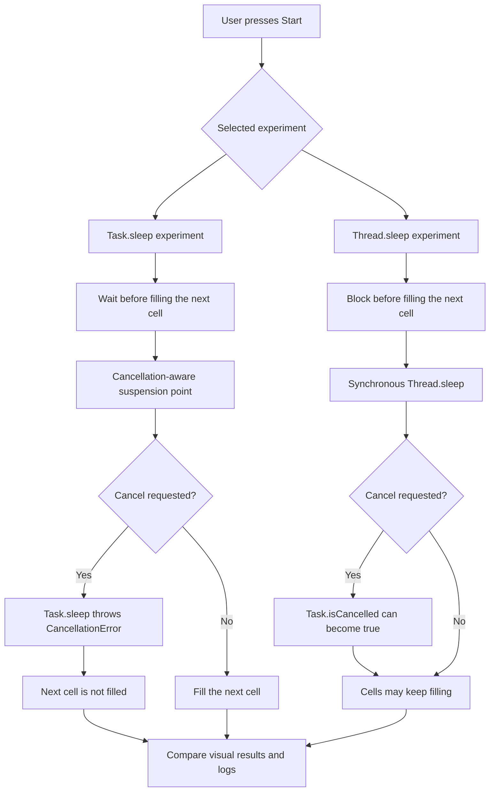

# Task Cancellation Lab

| Item | Content |
| --- | --- |
| Research Idea | Swift Concurrency |
| Essential Question | How can running tasks be safely controlled and canceled based on user input? |
| Challenge Statement | Design and implement task execution and cancellation flows using Swift Concurrency to manage asynchronous operations based on user input. |
| Challenge Response | To understand how cooperative cancellation works in Swift Concurrency, create a SwiftUI app and explanatory documentation that experiment with and visualize how Task cancellation changes depending on user input and async code conditions. |

## Research Background

Swift Concurrency makes asynchronous work easier to express with `Task`, `async`, and `await`. However, task cancellation can be easy to misunderstand. Calling `task.cancel()` does not force a task to stop immediately. It records a cancellation request, and the running code needs a point where it can cooperate with that request.

This project focuses on cooperative cancellation through a small visual experiment. The app compares `Task.sleep` and `Thread.sleep` because they look similar at first glance: both wait for time to pass. In Swift Concurrency, however, they behave very differently.

- `Task.sleep` is an async API that creates a cancellation-aware suspension point.
- `Thread.sleep` is a synchronous blocking call that does not automatically stop when a task is cancelled.

The goal is to make this difference visible. Instead of only reading about cancellation, users can press `Start`, press `Cancel`, and observe whether the next progress cell stops or keeps filling.

## Objective

The objective is to build a SwiftUI app that helps developers observe how task cancellation behaves under different async code conditions.

The lab investigates:

- How cancellation behaves as a request rather than forceful termination
- Why suspension points matter for cooperative cancellation
- How `Task.sleep` can throw `CancellationError` when cancellation is requested
- Why `Thread.sleep` can keep blocking even after a task is cancelled
- How `Task.isCancelled` can reveal cancellation state even when work continues
- Why blocking work should stay away from the MainActor in a SwiftUI app

Success is measured by whether the app makes the behavior visually understandable and whether the documentation explains why the behavior occurs.

## Methodology

The methodology is organized around one comparison: a cancellation-aware suspension point versus a synchronous blocking call.

The experiment process is:

1. Select either the `Task.sleep` or `Thread.sleep` experiment.
2. Press `Start` to begin filling 10 progress cells.
3. Press `Cancel` while a cell is waiting or blocking.
4. Observe whether the next cell stops or continues filling.
5. Compare the event log, especially `Task.isCancelled` and `CancellationError`.
6. Read the documentation to connect the visual behavior to Swift Concurrency concepts.

Detailed notes are available in:

- [`Docs/01-What-Is-Cooperative-Cancellation.md`](Docs/01-What-Is-Cooperative-Cancellation.md)
- [`Docs/02-Experiment-Guide.md`](Docs/02-Experiment-Guide.md)
- [`Docs/03-What-I-Learned.md`](Docs/03-What-I-Learned.md)
